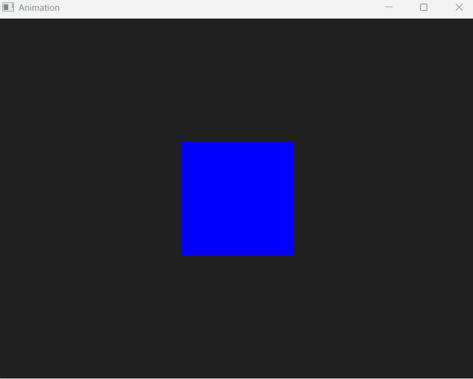

# QMLAnimationHandlingState

When we make animation through QML, we can use states to trigger those animations, if we create a QML file that is a Window with a simple rectangle like this one:

## QML file for a rectangle

```QML
Window {
    width: 640
    height: 480
    visible: true
    title: qsTr("Animation")

    color: "#202020"

    Rectangle {
        id: myRect
        anchors.centerIn: parent
        width: 150
        height: 150
        color: "gold"

        MouseArea {
            ....
        }
    }
}
```
Here we have a simple rectangle named `myRect` with height, width and color, that is centered in the parent, parent is simply the window of our application.

## Using MouseArea

Now that we have the `Rectangle` inside of the `Window` component, something we can do is give it the ability to respond to some user's event such as mouse click. We can do that by making use of the `MouseArea` component. Although we can add a `MouseArea` component onto the `Rectangle`, still we'll have to configure that `MouseArea` to behave when hovering the rectangle. There are several ways to do so, one way I will show you now is by handling the state.

## MouseArea using state

A component (displayable or not) can have an attribute called `state`:
```QML
....
Rectangle {
    id: myRect
    ...
    MouseArea {
        id: mouseArea
        ....
        hoverEnabled: true
        state: "weExit"
        ...
    }
}
```

If you look at the `MouseArea` component present in the `Rectangle` above, you will see that the `MouseArea` has the `hoverEnable` property set to true in order to handle the hover of its parent (in the case above, the rectangle id: `myRect`), also, this MouseArea has an attribute called `state` that is set to `weExit`.

### MouseArea handling States

Using this `mouseArea`, we can handle some states from its parent which is (in our case) the rectangle identified by `myRect`. In our case, we see that the state of the `mouseArea` is `weExit`, but what is the state `weExit` ? Actually it didn't came from nowhere but from another attribute bellow `state` that is `state*s*` in plural:

```QML
    Window {
        ....
        MouseArea {
            id: mouseArea
            anchors.fill: parent
            hoverEnabled: true
            state: "weExited"

            states: [
                State {
                    name: "weHovered"
                    PropertyChanges {
                        target: myRect
                        color: "lightgreen"
                        scale: 2
                    }
                },
                State {
                    name: "weExited"
                    PropertyChanges {
                        target: myRect
                        color: "blue"
                        scale: 1
                    }
                }
            ]
            ....
        }
    }
```
So the `state` attribute (singular one) will set the state of your `MouseArea`, and everytime a set change in this attribute, a state from the array `states` (plural one) is triggered, once the state is triggered, it will run a `PropertyChanges` component having the followings attribute to be set:

```QML
....
states: [
    State {
        name: "weHovered"
        PropertyChanges {
            target: myRect
            color: "blue"
            scale: 1
        }
    }
    ....
]
....
```
If we take a closet look at the states array, the one I describe above has the name weHovered, when we trigger this state, se will handle the attribute we are targetting using the `target` attribute. This `target` attribute is the id of the component we are targetting (in our case, the attribute is the rectangle identified by `myRect`) and the change will be the color and the scale of it

## Triggering the state

We want to trigger the state of your choosing when the user is hovering the Rectangle. We know for a fact that the `Rectangle` has an object of type `MouseArea` that is filling the entire object. That means we can trigger the `onClicked` and `onExited` signals using QML and `mouseArea` property for changing the state upon signal:

```QML
import QtQuick

Window {
    width: 640
    height: 480
    visible: true
    title: qsTr("Animation")

    color: "#202020"

    Rectangle {
        id: myRect
        anchors.centerIn: parent
        width: 150
        height: 150
        color: "gold"

        MouseArea {
            id: mouseArea
            anchors.fill: parent
            hoverEnabled: true
            state: "weExited"

            states: [
                State {
                    name: "weHovered"
                    PropertyChanges {
                        target: myRect
                        color: "lightgreen"
                        scale: 2
                    }
                },
                State {
                    name: "weExited"
                    PropertyChanges {
                        target: myRect
                        color: "blue"
                        scale: 1
                    }
                }

            ]

            transitions: [
                Transition {
                    from: "weExited"
                    to: "weHovered"

                    ParallelAnimation {
                        NumberAnimation {
                            property: "scale"
                            duration: 600
                        }

                        ColorAnimation {
                            property: "color"
                            duration: 600
                        }
                    }
                },
                Transition {
                    from: "weHovered"
                    to: "weExited"

                    ParallelAnimation {
                        NumberAnimation {
                            property: "scale"
                            duration: 600
                        }


                        ColorAnimation {
                            property: "color"
                            duration: 600
                        }
                    }
                }

            ]

            onEntered: {
                mouseArea.state = "weHovered"
            }

            onExited: {
                mouseArea.state = "weExited"
            }
        }
    }
}
```

## Result

